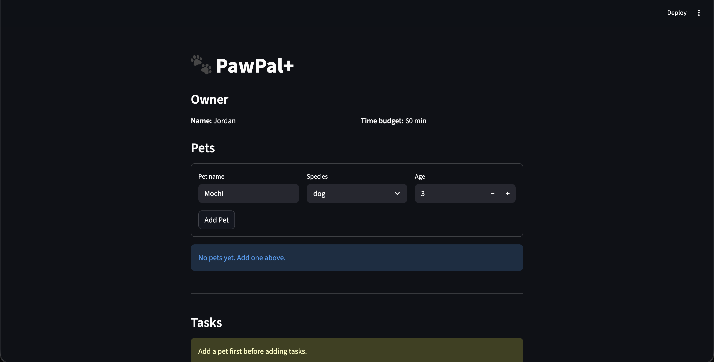

# PawPal+ (Module 2 Project)

You are building **PawPal+**, a Streamlit app that helps a pet owner plan care tasks for their pet.

## Scenario

A busy pet owner needs help staying consistent with pet care. They want an assistant that can:

- Track pet care tasks (walks, feeding, meds, enrichment, grooming, etc.)
- Consider constraints (time available, priority, owner preferences)
- Produce a daily plan and explain why it chose that plan

Your job is to design the system first (UML), then implement the logic in Python, then connect it to the Streamlit UI.

## Features

- **Modular OOP design** — `Task`, `Pet`, `Owner`, `DailyPlan`, `Planner`, and `Scheduler` each own a single responsibility.
- **Priority-first scheduling** — The `Planner` ranks tasks by priority (5 = critical) then duration, filling the owner's daily time budget and skipping tasks that don't fit.
- **Sorting by time** — `Scheduler.sort_by_time()` orders any task list chronologically using `HH:MM` string keys.
- **Filtering** — `Scheduler.filter_tasks()` returns tasks by pet name and/or completion status for a given day.
- **Recurring tasks** — `Scheduler.mark_task_complete()` marks a task done and automatically appends a new occurrence (`due_date = today + 1 day` for daily, `+ 7 days` for weekly).
- **Conflict warnings** — `Scheduler.detect_conflicts()` flags exact-time collisions across all pets and surfaces them as `st.warning` banners in the UI.
- **Streamlit UI** — Add owners, pets, and tasks through web forms; view tasks sorted by time; generate a daily plan with one click.

## What you will build

Your final app should:

- Let a user enter basic owner + pet info
- Let a user add/edit tasks (duration + priority at minimum)
- Generate a daily schedule/plan based on constraints and priorities
- Display the plan clearly (and ideally explain the reasoning)
- Include tests for the most important scheduling behaviors

## System Architecture (UML)

See [`uml_final.md`](uml_final.md) for the Mermaid.js class diagram showing how all classes relate.

## 📸 Demo

<a href="pawpal_demo.png" target="_blank"></a>

## Getting started

### Setup

```bash
python -m venv .venv
source .venv/bin/activate  # Windows: .venv\Scripts\activate
pip install -r requirements.txt
```

### Suggested workflow

1. Read the scenario carefully and identify requirements and edge cases.
2. Draft a UML diagram (classes, attributes, methods, relationships).
3. Convert UML into Python class stubs (no logic yet).
4. Implement scheduling logic in small increments.
5. Add tests to verify key behaviors.
6. Connect your logic to the Streamlit UI in `app.py`.
7. Refine UML so it matches what you actually built.

## Smarter Scheduling

This version of PawPal+ adds lightweight algorithmic features to improve scheduling:

- **Sorting by time:** Tasks include a `time` field (HH:MM) and can be sorted chronologically.
- **Filtering:** Tasks can be filtered by pet name or by completion status for today.
- **Recurring tasks:** Marking a `daily` or `weekly` task complete creates the next occurrence with an updated due date.
- **Conflict warnings:** The scheduler detects exact-time conflicts and returns friendly warnings instead of failing.

These features are implemented in `pawpal_system.py` under the `Scheduler` class and are demonstrated in `main.py`.

## Testing PawPal+

Run the automated tests with:

```bash
python -m pytest
```

Tests cover:

- Sorting correctness (chronological order)
- Recurrence creation when marking daily tasks complete
- Conflict detection for exact time matches

Confidence: ★★★★☆ (4/5) — Core scheduling behaviors are covered by tests; more integration/UI tests would increase confidence.
